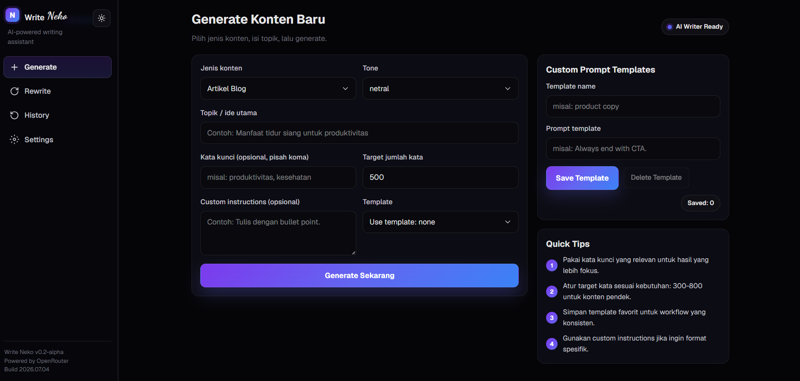

# Write Neko

Penyimpanan data dilakukan secara lokal, sementara inferensi AI menggunakan OpenRouter. Generate, rewrite, lanjutkan, analisis SEO, dan kelola artikel langsung dari browser dengan data tetap ada di workspace kamu.

[Repo GitHub](https://github.com/gerryabel/write-neko)

## Apa yang dilakukan

Write Neko adalah asisten penulis kecil yang berfokus pada drafting dan perbaikan konten menggunakan model OpenRouter. Artikel yang di-generate dan pengaturan aplikasi disimpan di workspace lokal, jadi tidak perlu akun atau sinkronisasi cloud.

Fitur yang sudah diterapkan:

- Generate artikel dari topik dengan tone, kata kunci, target panjang, dan template yang bisa digunakan ulang
- Rewrite artikel yang ada dengan penyesuaian tone dan kata kunci
- Melanjutkan atau meng-expand konten: lanjut natural, lebih pendek, atau lebih panjang
- Analisis SEO dengan skor lokal dan saran opsional dari AI
- Riwayat: pencarian, sorting, preview, copy, download `.md`, hapus
- Pengaturan: simpan API key dan model OpenRouter
- Manajemen template untuk prompt generasi yang bisa dipakai lagi
- Sidebar bersama dan komponen UI reusable di seluruh halaman

## Tech stack

| Layer | Tooling |
| --- | --- |
| Framework | Next.js 16 (App Router) |
| UI | React 19 + Tailwind CSS 4 |
| Bahasa | TypeScript |
| Storage | `better-sqlite3` + file `.md` lokal |
| Validasi | `zod` |
| Download helper | `jszip` |
| Lint | ESLint |

## Prasyarat

- Node.js 20+
- npm
- Windows/macOS/Linux; `better-sqlite3` dikompilasi untuk runtime Node lokal

## Instalasi

```bash
git clone https://github.com/gerryabel/write-neko.git
cd write-neko
npm install
```

## Menjalankan development

```bash
npm run dev
```

Buka [http://localhost:3000](http://localhost:3000).

## Konfigurasi

Buka `/settings` dan simpan API key OpenRouter serta model yang ingin dipakai. Nilai-nilai ini disimpan secara lokal di `saved_articles/articles.db`.

### Keamanan data lokal

`articles.db`, file artikel `.md`, templates, dan file runtime lain di bawah `saved_articles/` adalah data workspace lokal. Jangan commit file-file tersebut. Kalau perlu, tambahkan `saved_articles/` ke `.gitignore` sebelum membagikan atau mempublikasikan repo ini.

## Script npm

| Script | Fungsi |
| --- | --- |
| `npm run dev` | Menjalankan development server Next.js |
| `npm run build` | Membuat build production |
| `npm run start` | Menjalankan server production |
| `npm run lint` | Menjalankan ESLint |

## Struktur project

```
src/
  app/
    (main)/         # Halaman fitur + shared UI/sidebar
    api/            # Server route handlers
    globals.css
    layout.tsx
    page.tsx        # Root route
  components/       # Reusable client components
  lib/              # Storage, AI client, validation, types
saved_articles/     # Data runtime lokal: DB, markdown exports, templates
```

## Screenshots

| Halaman | Deskripsi |
| --- | --- |
|  | Halaman generate dengan presets dan editor |
|  | History dengan pencarian, sorting, preview, copy/download |
|  | Pengaturan API key dan model |

Jika kamu menambahkan screenshot, letakkan di `docs/screenshots/` dan pertimbangkan ukuran file agar tetap ringan.

## Catatan teknis

- Security headers respons dikonfigurasi di `next.config.ts`, termasuk `Content-Security-Policy`, `X-Frame-Options`, `Referrer-Policy`, dan `Permissions-Policy`.
- Beberapa API route menyetel `X-Content-Type-Options: nosniff`.
- Project ini tidak menggunakan autentikasi eksternal.

## Known limitations

- Data tetap di workspace lokal; tidak ada sinkronisasi antar perangkat.
- Kualitas generate bergantung pada model OpenRouter yang dipakai dan penulisan prompt.
- Saran SEO dari AI membutuhkan API key/model OpenRouter yang valid dan bisa gagal saat rate-limited atau tidak tersedia.
